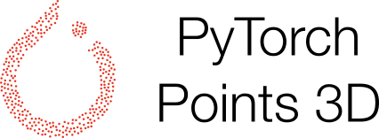

_Deep Point Cloud Benchmark_ is a framework for developing and testing common deep learning models to solve tasks related to unstructured 3D spatial data i.e. Point Clouds. The framework currently integrates some of the best published architectures and it  integrates the most common public datasests for ease of reproducibility. It heavily relies on [```Pytorch Geometric```](https://github.com/rusty1s/pytorch_geometric) and [```Facebook Hydra library```](https://hydra.cc/docs/intro) thanks for the great work!

We aim to build a tool which can be used for benchmarking SOTA models, while also allowing practitioners to efficiently pursue research into point cloud analysis,  with the end-goal of building models which can be applied to real-life applications.


# Core features

* ```Task``` driven implementation with dynamic model and dataset resolution from arguments.
* ```Core``` implementation of common components for point cloud deep learning - greatly simplifying the creation of new models:
    * ```Core Architectures``` - Unet
    * ```Core Modules``` - Residual Block, Down-sampling and Up-sampling convolutions
    * ```Core Transforms``` - Grid Sampling, Rotation, Scaling
    * ```Core Sampling``` - FPS, Random Sampling
    * ```Core Neighbour Finder``` - Radius Search, KNN
* 4 ```Base Convolution``` base classes to simplify the implementation of new convolutions. Each base class supports a different data format (B = number of batches, C = number of features):
    * ```DENSE``` (B, num_points, C)
    * ```PARTIAL DENSE``` (B * num_points, C)
    * ```MESSAGE PASSING``` (B * num_points, C)
    * ```SPARSE``` (B * num_points, C)

* Models can be completely specified using a YAML file, greatly easing reproducability. 
* Several visualiation tools ```(tensorboard, wandb)``` and _dynamic metric-based model checkpointing_, which is easily customizable. 
* _Dynamic customized placeholder resolution_ for smart model definition.

# Supported models
The following models have been tested and validated:

* [```Relation-Shape Convolutional (RSConv)``` Neural Network for Point Cloud Analysis](https://arxiv.org/abs/1904.07601)
* [```KPConv```: Flexible and Deformable Convolution for Point Clouds](https://arxiv.org/abs/1904.08889)
* [```PointCNN```: Convolution On X-Transformed Points](https://arxiv.org/abs/1801.07791)
* [```PointNet++```: Deep Hierarchical Feature Learning on Point Sets in a Metric Space](https://arxiv.org/abs/1706.02413)

We are actively working on adding the following ones to the framework:

* [```RandLA-Net```: Efficient Semantic Segmentation of Large-Scale Point Clouds ](https://arxiv.org/pdf/1911.11236.pdf) - implemented but not completely tested
* [```4D Spatio-Temporal ConvNets: Minkowski Convolutional Neural Networks```](https://arxiv.org/abs/1904.08755) - Actively being worked on

and much more to come ...


# Supported tasks

* Segmentation
* Registration
* Classification [TO COME]
* Object detection [TO COME]


